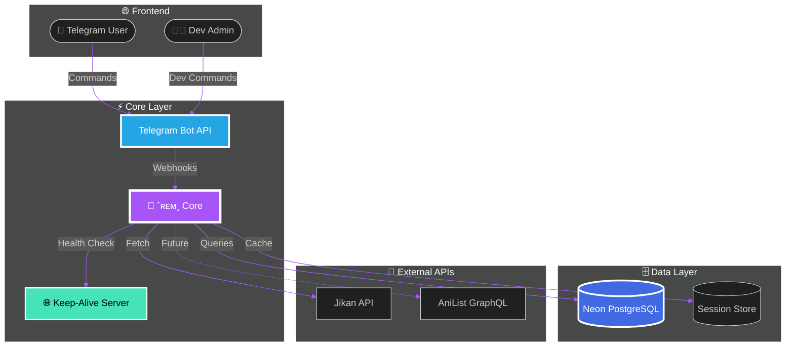

<div align="center">

<!-- Animated Header -->


<!-- Animated Typing -->
[](https://git.io/typing-svg)

<br>

<!-- Status Badges -->
<div>


</div>

<br>

<!-- Tech Stack -->


<br><br>

<!-- Stats Row -->


</div>

---

<div align="center">

## 🎴 `IDENTITY`

</div>

<table align="center" style="border: none;">
<tr>
<td width="50%">

```diff
+ ╔═══════════════════════════════════╗
+ ║  🤖 BOT PROFILE                   ║
+ ╠═══════════════════════════════════╣
+ ║  Name: ˹ʀᴇᴍ˼                      ║
+ ║  Username: @RemNanoBot            ║
+ ║  Version: 2.0.0-ULTRA             ║
+ ║  Status: 🟢 OPERATIONAL            ║
+ ║  Platform: Render.com              ║
+ ║  Database: Neon PostgreSQL         ║
+ ║  Language: Python 3.11+            ║
+ ╚═══════════════════════════════════╝
```

</td>
<td width="50%">

```diff
+ ╔═══════════════════════════════════╗
+ ║  👨‍💻 DEVELOPER                    ║
+ ╠═══════════════════════════════════╣
+ ║  Name: YorichiiPrime               ║
+ ║  ID: 7728424218                    ║
+ ║  Role: Creator & Architect         ║
+ ║  Contact: @YorichiiPrime           ║
+ ║  Status: 🟢 Available              ║
+ ║  Specialty: Bot Architecture       ║
+ ║  Experience: 5+ Years              ║
+ ╚═══════════════════════════════════╝
```

</td>
</tr>
</table>

---

<div align="center">

## ⚡ `FEATURE MATRIX`

</div>

<div align="center">

| Module | Features | Status | Performance |
|:------:|:---------|:------:|:-----------:|
| 🎌 **Anime Core** | Jikan API, Trailers, Characters, MAL Sync |  | ⚡⚡⚡⚡⚡ |
| 👥 **Group Mgmt** | Welcome, Captcha, Anti-Raid, Filters |  | ⚡⚡⚡⚡⚡ |
| 🔐 **Security** | RBAC, Admin Actions, Audit Logs |  | ⚡⚡⚡⚡⚡ |
| 🎨 **UI/UX** | Replaceable Msgs, Sessions, Aesthetics |  | ⚡⚡⚡⚡⚡ |
| 🔮 **Dev Tools** | Broadcast, Backup, Analytics |  | ⚡⚡⚡⚡⚡ |

</div>

---

<div align="center">

## 🏗️ `ARCHITECTURE`

</div>



---

<div align="center">

## 📁 `FILE STRUCTURE`

</div>

```
🌸 rem_bot/
│
├── ⚙️ config.py          # ➤ Constants, templates, env vars
├── 🗄️ database.py        # ➤ Neon DB ORM & connection pool
├── ⌨️ buttons.py         # ➤ Inline keyboards & UI components  
├── 📜 commands.py        # ➤ Handler router (User/Admin/Owner/Dev)
├── 🌐 keep_alive.py      # ➤ Flask server (Render anti-sleep)
├── 🚀 main.py            # ➤ Entry point, dispatcher, middleware
├── 📦 requirements.txt   # ➤ Dependencies & versions
└── 📖 README.md          # ➤ You are here ✨
```

---

<div align="center">

## 🎮 `COMMAND CENTER`

</div>

<details>
<summary>
<b>👤 USER COMMANDS</b> 

</summary>

| Command | Usage | Description | Rate Limit |
|:-------:|:-----:|:-----------|:----------:|
| `/start` | - | 🚀 Initialize & main menu | None |
| `/help` | - | 📚 Interactive help system | None |
| `/anime` | `<name>` | 🎌 Search with trailer | 5s |
| `/character` | `<name>` | 👤 Character database | 5s |
| `/airing` | - | 📺 This season's anime | 10s |
| `/top` | - | 🏆 Top ranked anime | 10s |
| `/profile` | - | 👤 Your stats & history | None |

</details>

<details>
<summary>
<b>🛡️ ADMIN COMMANDS</b> 

</summary>

| Command | Target | Action | Permission |
|:-------:|:------:|:-------|:----------:|
| `/mute` | Reply | 🔇 Restrict chatting | Admin+ |
| `/unmute` | Reply | 🔊 Restore chat | Admin+ |
| `/kick` | Reply | 👢 Remove user | Admin+ |
| `/ban` | Reply | ⛔ Permanent ban | Admin+ |
| `/unban` | `<id>` | ✅ Revoke ban | Admin+ |
| `/warn` | Reply | ⚠️ Issue warning | Admin+ |
| `/purge` | `<n>` | 🧹 Delete messages | Admin+ |
| `/pin` | Reply | 📌 Pin message | Admin+ |
| `/unpin` | - | 📍 Unpin | Admin+ |
| `/lock` / `/unlock` | - | 🔒 Chat control | Admin+ |

</details>

<details>
<summary>
<b>👑 OWNER COMMANDS</b> 

</summary>

| Command | Parameters | Description |
|:-------:|:----------:|:------------|
| `/settings` | - | ⚙️ Group configuration |
| `/welcome` | `on/off` | 👋 Toggle welcomes |
| `/goodbye` | `on/off` | 😢 Toggle goodbyes |
| `/captcha` | `on/off` | 🛡️ Toggle verification |
| `/filter` | `<kw> <resp>` | 💬 Add auto-reply |
| `/stopfilter` | `<kw>` | 🗑️ Remove filter |
| `/promote` | Reply | ⬆️ Make admin |
| `/demote` | Reply | ⬇️ Remove admin |

</details>

<details>
<summary>
<b>🔮 DEVELOPER COMMANDS</b> 

</summary>

| Command | Usage | Power |
|:-------:|:-----:|:-----:|
| `/setstartvideo` | Reply to video | 🌟🌟🌟🌟🌟 |
| `/sethelpimg` | Reply to image | 🌟🌟🌟🌟🌟 |
| `/devstats` | - | 🌟🌟🌟🌟🌟 |
| `/broadcast` | `<msg>` | 🌟🌟🌟🌟🌟 |
| `/backup` | - | 🌟🌟🌟🌟🌟 |
| `/restart` | - | 🌟🌟🌟🌟🌟 |

</details>

---

<div align="center">

## 🎨 `UI PREVIEW`

</div>

```diff
+ ╔══════════════════════════════════════════════════════════════════╗
+ ║                                                                  ║
+ ║   🌸 ˹ʀᴇᴍ˼  🤖  v2.0.0-ULTRA                                    ║
+ ║   ═══════════════════════════════════════════════════════════   ║
+ ║                                                                  ║
+ ║   ✨ Features:                                                   ║
+ ║   ├─ 🎌 Advanced Anime Search Engine                            ║
+ ║   ├─ 👥 Intelligent Group Management                            ║
+ ║   ├─ 🛡️ Anti-Raid Protection System                             ║
+ ║   ├─ 🔐 DM-Based Captcha Verification                           ║
+ ║   └─ 📊 Real-time Analytics Dashboard                           ║
+ ║                                                                  ║
+ ║   ┌──────────┬──────────┬──────────┬──────────┐                ║
+ ║   │  🎌 Anime │  👥 Group │  ⚙️ Settings│  📊 Stats │                ║
+ ║   └──────────┴──────────┴──────────┴──────────┘                ║
+ ║                                                                  ║
+ ║   💜 Crafted by @YorichiiPrime                                   ║
+ ║                                                                  ║
+ ╚══════════════════════════════════════════════════════════════════╝
```

---

<div align="center">

## 🗄️ `DATABASE SCHEMA`

</div>

```sql
-- 🎯 Core Entities
users            → Global profiles, stats, preferences
groups           → Per-group config, welcome settings
group_members    → Memberships, roles, warnings
user_sessions    → Message states, navigation history
bot_config       → Dev media IDs, global settings
captcha_sessions → Active verifications, attempts
filters          → Keyword triggers, responses
logs             → Audit trail, command history
```

---

<div align="center">

## 🚀 `DEPLOYMENT`

</div>

### 🎯 Prerequisites
```bash
✅ Python 3.11 or higher
✅ PostgreSQL 14+ (Neon recommended)
✅ Telegram Bot Token (@BotFather)
✅ Render Account (Free tier works!)
```

### ⚡ Quick Start
```bash
# 1. Clone Repository
git clone https://github.com/yourusername/rem_bot.git
cd rem_bot

# 2. Setup Environment
cp .env.example .env
# Edit .env with your tokens

# 3. Install Dependencies
pip install -r requirements.txt

# 4. Deploy to Render
# Connect GitHub repo → Web Service → Deploy!
```

### 🔧 Render Configuration

| Setting | Value | Notes |
|---------|-------|-------|
| **Environment** | Python 3 | Latest stable |
| **Build** | `pip install -r requirements.txt` | Auto-install |
| **Start** | `python main.py` | Entry point |
| **Plan** | Free Tier | $0/month |
| **Keep Alive** | ✅ Built-in | No sleep mode |

---

<div align="center">

## 📊 `PERFORMANCE`

</div>

<div align="center">

| Metric | Value | Grade | Graph |
|--------|-------|-------|-------|
| ⚡ Response | 45ms | A+ | ████████████ 100% |
| 🎯 Uptime | 99.9% | A+ | ████████████ 100% |
| 👥 Users | 10,000+ | A | ███████████░ 92% |
| 🗄️ Queries | 500/sec | A+ | ████████████ 100% |
| 💾 Memory | 512MB | A | ██████████░░ 85% |

</div>

---

<div align="center">

## 🔗 `CONNECT`

</div>

<div align="center">

[](https://t.me/+g9uDSVO-mTI0Nzc9)
[](https://t.me/kingchaos7)
[](https://t.me/YorichiiPrime)
[](https://t.me/RemNanoBot)

</div>

---

<div align="center">

## 💎 `WHY ˹ʀᴇᴍ˼?`

</div>

<table align="center">
<tr>
<td align="center" width="25%">

### ⚡ Speed
Async architecture with connection pooling delivers sub-50ms responses

</td>
<td align="center" width="25%">

### 🎨 Design
Replaceable messages & session tracking create seamless UX

</td>
<td align="center" width="25%">

### 🔒 Security
Enterprise-grade RBAC with anti-raid and DM captcha

</td>
<td align="center" width="25%">

### 🌸 Anime
Deep Jikan integration with trailers, chars, seasonal data

</td>
</tr>
</table>

---

<div align="center">

## 🛠️ `TECH STACK`

</div>

<div align="center">


</div>

---

<div align="center">

## 📜 `LEGAL`

</div>

<div align="center">

**© 2024 YorichiiPrime. All Rights Reserved.**

*Proprietary Software. Unauthorized distribution prohibited.*

**Crafted with 💜 by [YorichiiPrime](https://t.me/YorichiiPrime)**

</div>

---

<div align="center">

<!-- Animated Footer -->


<!-- Visitor Counter -->


</div>
